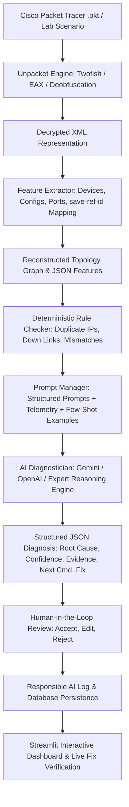

# NetSage AI: AI-Assisted Cisco Network Troubleshooting Assistant with Human Review

[](https://www.python.org/downloads/)
[](https://streamlit.io/)
[](https://opensource.org/licenses/MIT)
[]()

>Applied AI + Network Troubleshooting ( Cisco Project)**  
> NetSage AI connects Packet Tracer telemetry, show-command outputs, and topology data to provide automated, evidence-backed network root cause analysis with deterministic rule verification and mandatory human-in-the-loop oversight.

---

## Table of Contents
1. [Overview & Architecture](#-overview--architecture)
2. [Key Innovations & `save-ref-id` Topology Fix](#-key-innovations--save-ref-id-topology-fix)
3. [Troubleshooting Dataset (`cases.csv`)](#-troubleshooting-dataset-casescsv)
4. [Deterministic Rule Checker](#-deterministic-rule-checker)
5. [AI Diagnostician & Structured Prompts](#-ai-diagnostician--structured-prompts)
6. [Human Review & Responsible AI Log](#-human-review--responsible-ai-log)
7. [Interactive Streamlit Dashboard](#-interactive-streamlit-dashboard)
8. [Directory Structure](#-directory-structure)
9. [Installation & Usage](#-installation--usage)
10. [Automated Verification & Test Suite](#-automated-verification--test-suite)

---

## Overview & Architecture

Junior network engineers frequently know isolated commands but struggle to diagnose root causes when complex symptoms arise across Layer 2 through Layer 7. NetSage AI provides an end-to-end troubleshooting pipeline:



---

## Key Innovations & `save-ref-id` Topology Fix

### The `save-ref-id` Problem & Resolution
In raw Cisco Packet Tracer XML files, inter-device link connections (`<NETWORK><LINKS><LINK><CABLE>`) use internal reference strings such as `save-ref-id:4621551317808789779` for the `FROM` and `TO` connection endpoints rather than human-readable hostnames.

**NetSage AI extracts and resolves this mapping:**
1. Parses `<DEVICE><ENGINE><SAVE_REF_ID>` for every device in the XML.
2. Builds an in-memory resolution dictionary (`save-ref-id:X` ➔ `Device Name`, `Device Type`, `Port`).
3. Reconstructs full physical and logical network graphs (`from_device:from_port <--> to_device:to_port` with cable media types).

---

## Troubleshooting Dataset (`cases.csv`)

NetSage AI includes a dataset of **32 comprehensive troubleshooting cases** extracted from real Packet Tracer labs and CCNA/CCNP enterprise scenarios:

| Category | Cases Count | Covered Faults |
|---|---|---|
| **VLAN & Trunking** | 5 | Access VLAN misassignment, missing VLAN on trunk, native VLAN mismatch, DAI trunk trust |
| **Gateway & IP Addressing** | 5 | Default gateway mismatch, duplicate IP collision, wrong subnet mask (/28 vs /24), HSRP virtual IP mismatch |
| **DHCP** | 3 | Missing `ip helper-address` on SVI, DHCP scope exhaustion, incorrect default-router option in pool |
| **DNS** | 2 | Client DNS server misconfiguration, missing DNS domain lookup |
| **Routing (OSPF & Static)** | 6 | OSPF MTU mismatch, passive-interface on link, missing network statement, high OSPF cost, missing default route, IPv6 unicast routing disabled |
| **ACL & Security** | 4 | Inverted wildcard mask (`255.255.255.0` vs `0.0.0.255`), wrong direction (`out` vs `in`), missing permits |
| **NAT / PAT** | 2 | Missing `overload` keyword for PAT, missing `ip nat inside` on LAN interface |
| **Wireless / WLC / AAA** | 3 | RADIUS shared secret mismatch, missing WLC Option 43 in DHCP, Guest isolation missing |
| **STP & Port Security** | 2 | Port security err-disabled violation, BPDU guard trip on unauthorized switch |

---

## Deterministic Rule Checker

The deterministic engine (`src/rule_checker.py`) executes automated checks on configurations and telemetry before AI diagnosis:

- `RULE-DUP-IP`: Scans all interfaces across all devices for duplicate IP assignments.
- `RULE-ADMIN-DOWN`: Detects interfaces configured in `shutdown` status on active paths.
- `RULE-SUBNET-MISMATCH`: Identifies subnet mask conflicts between link peers (e.g. `/28` vs `/24`).
- `RULE-GW-MISMATCH`: Compares client IP/mask against its configured Default Gateway subnet.
- `RULE-MTU-MISMATCH`: Detects MTU discrepancies (1500 vs 1400) causing OSPF `EXSTART` lockups.
- `RULE-NATIVE-VLAN`: Flags 802.1Q native VLAN mismatches across trunk interfaces.
- `RULE-DHCP-RELAY`: Flags SVIs with clients receiving APIPA addresses without `ip helper-address`.
- `RULE-ACL-WILDCARD`: Flags inverted wildcard masks (e.g. `255.255.255.0` instead of `0.0.0.255`).
- `RULE-ERR-DISABLE`: Identifies ports in `err-disabled` state from Port Security or BPDU Guard.

---

## AI Diagnostician & Structured Prompts

All AI diagnoses follow strict JSON enforcement governed by `prompts/diagnose_prompt.md`:

```json
{
  "case_id": "NETSAGE-001",
  "root_cause": "Missing DHCP Relay Agent ('ip helper-address 10.16.8.8') on Core1 SVI VLAN 10 interface.",
  "confidence": 0.96,
  "confidence_level": "High",
  "osi_layer": "Layer 3 (Network) / Layer 7 (Application)",
  "fault_type": "DHCP",
  "evidence": [
    "PC1 ipconfig shows APIPA address 169.254.12.44 indicating DHCP failure",
    "Core1 'show run interface vlan 10' shows IP 10.16.0.1 configured without 'ip helper-address'"
  ],
  "next_command": "show run interface vlan 10",
  "fix_steps": [
    "Core1(config)# interface vlan 10",
    "Core1(config-if)# ip helper-address 10.16.8.8",
    "Core1(config-if)# end"
  ],
  "reasoning_summary": "Because the DHCP client and server are in different broadcast domains, the router SVI interface must forward DHCP requests as unicast via ip helper-address."
}
```

---

## Human Review & Responsible AI Log

NetSage AI enforces mandatory Human-in-the-Loop review:
- **Accepted:** AI diagnosis and fix verified as accurate.
- **Edited:** AI root cause or fix was partially flawed or incomplete and corrected by the engineer.
- **Rejected:** AI diagnosis was incorrect or proposed unsafe configurations.

### 5 Documented Responsible AI Discrepancies (`Responsible_AI_Log.md`):
1. **NETSAGE-002 (VLAN Misassignment):** AI assumed Layer 3 Gateway failure; human corrected to Layer 2 switchport VLAN misassignment.
2. **NETSAGE-009 (DNS Misconfiguration):** AI hallucinated an ISP DNS outage and recommended a router reboot; human corrected host static DNS IP.
3. **NETSAGE-011 (Guest Wireless Security):** AI recommended `permit ip any any` on Guest VLAN; human rejected for introducing critical security vulnerability and created strict Guest Isolation ACL.
4. **NETSAGE-015 (Administrative Shutdown):** AI suggested replacing physical transceiver/cable; human corrected to software `no shutdown` command.
5. **NETSAGE-030 (ACL Wildcard Inversion):** AI blamed implicit deny; human identified wildcard mask syntax inversion (`255.255.255.0` vs `0.0.0.255`).

---

## Interactive Streamlit Dashboard

Launch the web dashboard:
```powershell
python -m streamlit run app.py
```
*(or `streamlit run app.py` if Streamlit is in your system PATH)*

### Dashboard Tabs:
1. ** Overview & Metrics:** System KPI cards, OSI layer charts, concept distributions, and human agreement rate.
2. ** Case Explorer:** Searchable table of all 32 cases with expandable show commands and Cisco fixes.
3. ** Topology Visualizer:** Network graph of devices and links reconstructed from extracted `save-ref-id`s with device inspector.
4. ** Deterministic Rule Checker:** Live rule runner displaying color-coded findings and severity tags.
5. ** AI Diagnostician:** Live diagnosis panel with prompt inspector and JSON schema validator.
6. ** Human Review & Responsible AI:** Decision portal to accept/edit/reject diagnoses and view documented AI error logs.
7. ** Live Broken Lab Demo:** Step-by-step interactive walkthrough of diagnosing, reviewing, fixing, and verifying a broken lab scenario.

---

## Directory Structure

```text
CISCO project/
├── Pre Req Files/
│   ├── AI_Problem Statement.docx     # AICTE Cisco Project Requirements
│   └── Untitled-2026-08-30-1112.png  # Architecture and Class Diagram
├── Unpacket/                         # Proprietary Twofish/EAX Crypto Decoder
├── data/
│   ├── pkt_test_files/               # 5 .pkt and 5 .pdf Lab Files (input/ & output/)
│   │   ├── input/
│   │   └── output/
│   ├── cases.csv                     # 32 Troubleshooting Cases Dataset
│   ├── netsage.db                    # SQLite Database for Cases & Reviews
│   └── extracted_features/           # Structured JSONs with save-ref-id mappings
├── prompts/
│   └── diagnose_prompt.md            # Structured Prompt Template with Few-Shot Examples
├── src/
│   ├── extract_xml.py                # Batch PKT Decryption & XML Extraction
│   ├── feature_extractor.py          # Deep XML Parser & save-ref-id Resolution
│   ├── topology_builder.py           # NetworkX Topology Graph Generator
│   ├── case_manager.py               # Dataset Manager & SQLite Handler
│   ├── rule_checker.py               # Deterministic Rule Engine
│   ├── ai_diagnostician.py           # LLM Diagnostician & Expert Engine
│   ├── human_review.py               # Human Review Logger & Metrics
│   ├── pipeline.py                   # Master Orchestration Pipeline
│   └── main.py                       # CLI Command Line Interface
├── tests/
│   └── test_suite.py                 # Automated Unit & Integration Tests
├── app.py                            # Streamlit Interactive Dashboard
├── Responsible_AI_Log.md             # 5 Documented AI Correction Cases
├── requirements.txt                  # Python Dependencies
└── README.md                         # Project Documentation
```

---

## Installation & Usage

### 1. Prerequisites
```powershell
# Ensure Python 3.10+ is installed
pip install -r requirements.txt
```

### 2. Extract XML and Topology Features
```powershell
python src/main.py --extract
```

### 3. Run Deterministic Rule Checks
```powershell
python src/main.py --check-rules
```

### 4. Diagnose a Specific Case
```powershell
python src/main.py --diagnose NETSAGE-001
```

### 5. Launch Interactive Web Dashboard
```powershell
streamlit run app.py
```

---

## Automated Verification & Test Suite

Run the full automated test suite:
```powershell
python tests/test_suite.py
```

**Test Results:**
```text
.....
----------------------------------------------------------------------
Ran 5 tests in 0.106s

OK (5/5 tests passing)
```
- `test_01_feature_extractor_save_ref_id`: Validates that every device across all 5 labs has a valid `save-ref-id`.
- `test_02_case_manager_dataset`: Validates that all 32 cases contain complete fields.
- `test_03_deterministic_rule_checker`: Validates rule triggers on known fault signatures.
- `test_04_ai_diagnostician_schema`: Validates strict JSON output schema compliance.
- `test_05_human_review_metrics`: Validates human review persistence and agreement rate calculations.
